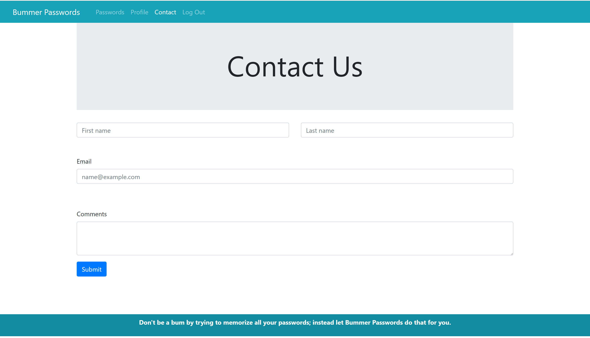

# Bummer Passwords
Bummer Passwords was built to help assist in remembering and creating passwords for all the different website you use. 
We used Firebase as our database. We utilized the email authentication to allow each user to have their own page of usernames and password. Afterall, you don't want everyone else to have access to that. Once you log in, you can update you profile page if you would like.  When you navigate to the passwords page, you can start to add websites with corresponding usernames and passwords. There is also a random password generator that you can use. Passwordrandom.com is the generator that we used.  We also incorporated a contact page that will allow the user to submit questions or comments to us. We used the mailthis.to api to get the comments to send to our designated email address. 
